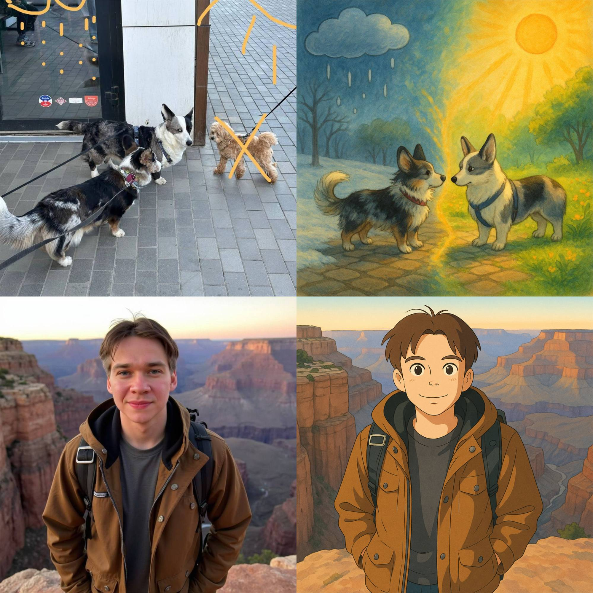
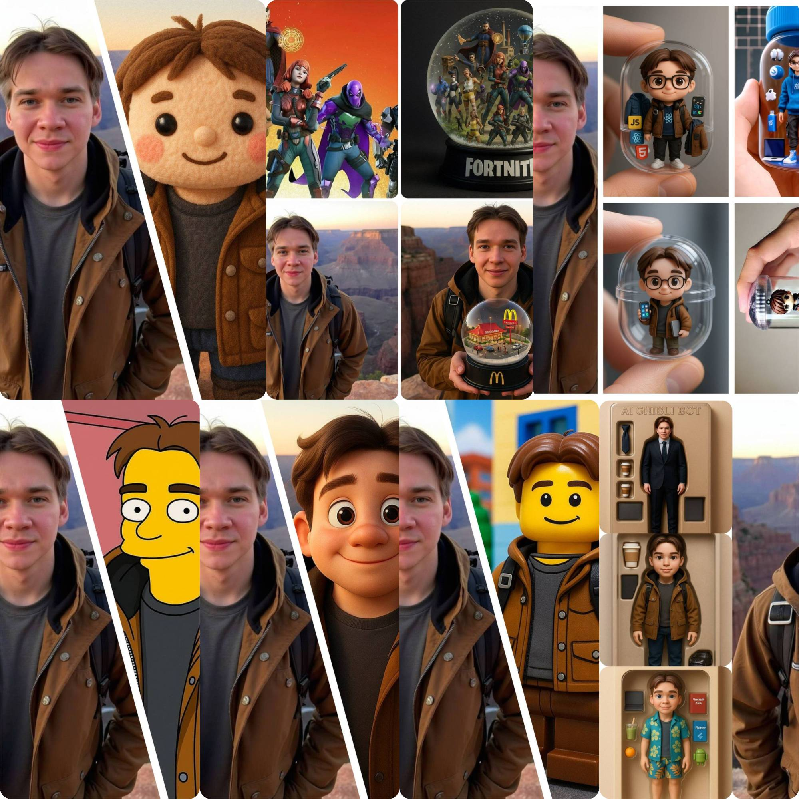
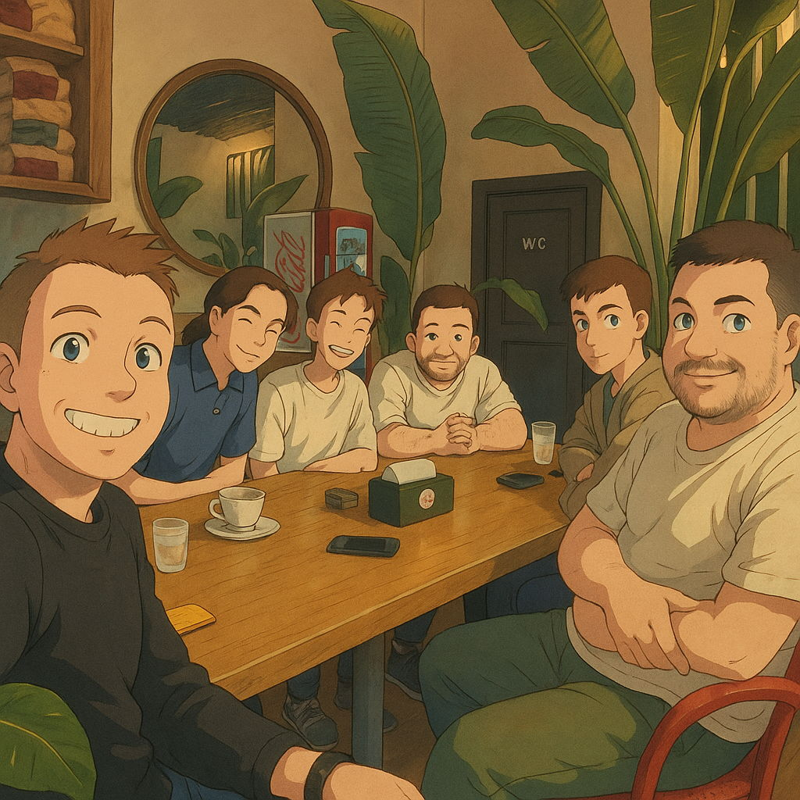

# Как я делал свой телеграм бот с функциями обработки изображений (AI) (Ghibli/Pixar и другие)

# Введение

25 Марта 2025 года OpenAI [выпустила анонс](https://openai.com/index/introducing-4o-image-generation/) своей модели для обработки фотографий при помощи их мультимодальной модели gpt-4o. Примерно в начале Марта в моем списке будущих пет проектов появился новый пункт: AI Core Box - расширяемый и универсальный CORE API для работы с различными AI моделями.

## Изыскания и выбор идеи

Эта мысль не давала мне покоя, я начал с базового поиска различных AI моделей, выполняющих полезные функции. Мой взор упал на HuggingFace и Replicate. Финальный выбор пал на Replicate, по сути это SaaS, который дает простую возможность использовать различные модели в их дашборде и API. Модели разделены по категориям. Крупные AI разработчики и opensource разработчики с удовольствием публикуют туда свои модели и дают возможность сообществу использовать любую из них через интерфейс и оплаты в Replicate.

Несколько дней я потратил на то, чтобы узнать у своих друзей-предпринимателей их мнение, видение и оценку описываемого мной продукта. Спустя еще несколько дней размышлений, идею Core AI Box удалось перефразировать в "Давайте сделаем некое ядро по работе с различными AI моделями, максимально тупое и без лишней логики, а поверх этой коробки, мы будем наращивать различные продукты по работе с ИИ", я получил в каком-то смысле отказ от сотрудничества, но не сдался. Я целиком технарь, мне сложно и чуждо заниматься своим "бизнесом", но сдаваться мне не хотелось и было дико интересно реализовать продукт с AI больше, чем базовый кодревью (такое я уже делал раньше, но не более).

Несколько недель проработки различных идей пет проектов с AI, множество попыток тестирования и упрощения и тут, как гром среди ясного неба, OpenAI добавляет новую мультимодальную модель в chatgpt. Это стало звоночком. Переосмыслив эту историю, родилась простая идея: Бот по обработке фотографии в стиле Ghibli Студии. Первый релиз состоялся 18 апреля 2025 года.

# Период кранча

Примерно 3 дня у меня заняла проработка различных решений для этой задачи. На тот момент еще не было готовых SaaS платформ под Ghibli стилизацию. Известные решения на рынке, вышедшие до gpt-4o, выдавали полную дичь. Я даже нашел несколько древних ботов, использующих те самые модели с Replicate и одного конкурента, родившегося еще 27 марта, по крайней мере в эту дату, ребята создали свой канал. Судорожно перебрав несколько страниц поиска и различные варианты текстовых запросов удалось найти первое более-менее стабильное решение - PiApi. Впоследствии удалось найти еще несколько SaaS продуктов.

У меня есть догадки, как этим SaaS удалось обойти ограничения отсутствия официального API, но ввиду своей занятости, повторить их путь было трудно. Поэтому я просто начал добавлять и тестировать текущие решения на рынке. 

За следующие 4 дня удалось создать первые версии AI Core Box и Ghibli AI Bot. Бот был сырой, недостаточно понятный и само решение по генерации было сущим кошмаром. Буквально на следующий день, после ночного анонса на свой круг знакомых о готовом боте и бесплатных доступах - PiApi умер (Их генерация по итогу не работала примерно 1-2 недели). В тот же день, ближе к вечеру, удалось найти время и добавить новое решение, которое оказалось чуть более стабильным. На протяжении еще нескольких дней, формат ответов менялся и приходилось дорабатывать обработку ответов по Stream запросам. Параллельно с этим удалось дописать реферальную систему, подарочные генерации по публичным ссылкам в бота и аналитику. Добавился cdn для загружаемых и итоговых медиа файлов, обработка octet-stream файлов от Midjourney и проработка модерационных ошибок в том числе NSFW (для добавления информативности пользователям о причине отказа генерации). Еще была проработка и удешевление цен и добавления запасных провайдеров для продолжения генераций (повышение отказоустойчивости).

Суммарно, на демо продукт ушло порядка двух недель, дополнительно была добавлена модель Kling для создания видео из обработанных в боте фотографий и функционал промо кодов для маркетинговых задач.

## Продукт на текущей стадии

На сегодняшний день, бот вполне успешно решает поставленную задачу. Тренд первого дня уже утихает и остается открытым вопрос, как именно развивать текущего бота. Однако 2 итоговых продукта, дают огромный потенциал на очень быстрый TTP (time to prod..) и тестирования различных гипотез в такой же или смежной идее.

Текущий же бот по обработке фотографий уже умеет:
- Работать с загружаемыми фотографиями
- Параллельная генерация
- При помощи комментариев к фотографии можно дать инструкции к ожидаемому результату, а редактирование фотографии средствами телеграм, даст более детальные инструкции к ожидаемой генерации
- Генерация видео из итоговой фотографии, с обязательным комментарием по ожидаемому поведению (есть идея доработать шаблоны для промптов генерации)
- Реф система с накоплением отчислений и последующим выводом
- Бонусные генерации и промо коды через обработку стратегий доступа к боту (админский функционал)
- Различные функции сбора статистики использования (админский функционал)

В качестве стека использовался: Nestjs, Firebase (Firestore) и Telegraf для работы с Telegram API

Ниже результат генерации видео из фотографии

  <video width="320" height="240" controls>
    <source src="./images/Kling%201.6.mp4" type="video/mp4">
    Kling 1.6 standart (текущая имплементация)
  </video>
  <video width="320" height="240" controls>
    <source src="./images/Gen-4%20Turbo.mp4" type="video/mp4">
    4gen-turbo Runway
  </video>

## Возможности для B2B и сотрудничества

Если Вам интересно познакомиться с результатом, [переходите в бота по ссылке](https://t.me/ghibli_ai_maker_bot?start=_irf_MTU3MjU3NTc1). Я не откажусь от различных форматов сотрудничества и продвижения, проработки или улучшения текущего функционала или внедрение похожего продукта из сферы AI в ваши бизнес процессы. Вау эффект и клиентоориентированность - может стать хорошим дополнением для B2B продуктов с AI.

Сегодня мне интересно, как создание пилотов для готового бизнеса, так и расширение текущего состава новыми партнерствами. По партнерствам особенно интересно, если будущий партнер имеет опыт в IT продуктах, готов расширить или придать видение и область применения AI решений и работает с привлечением трафика, на самом деле, маркетинг - остается самой важной частью продуктов, на мой взгляд.

## Заключение

Я уже не первый раз делаю пет проекты под платформу Telegram. Самое сложно из задач - это поддержка стабильности обработки фотографий. Моей целью было сделать демо фан продукт, который на данном этапе, лего расширять и продвигать, как в B2C сегменте, так и в B2B. Однако, на данном этапе, складывается ощущение, что в B2C, пользователи не готовы платить за "Фан" и "Тренды". Я вижу большой потенциал в AI решениях и продолжу развивать как текущего бота, так и придумывать новых. В планах: попробовать выпустить Flutter приложение для iOS/Android и переиспользовать интерфейс для Web платформы. Проработать вариации видео генераций, возможно добавить Runway 4gen-turbo (по моим изысканиям, у Runway результативность и API намного интереснее, чем у Kling через Replicate API). Так же хочется изучить потенциал и возможности моделей по работе с NSFW контентом.

